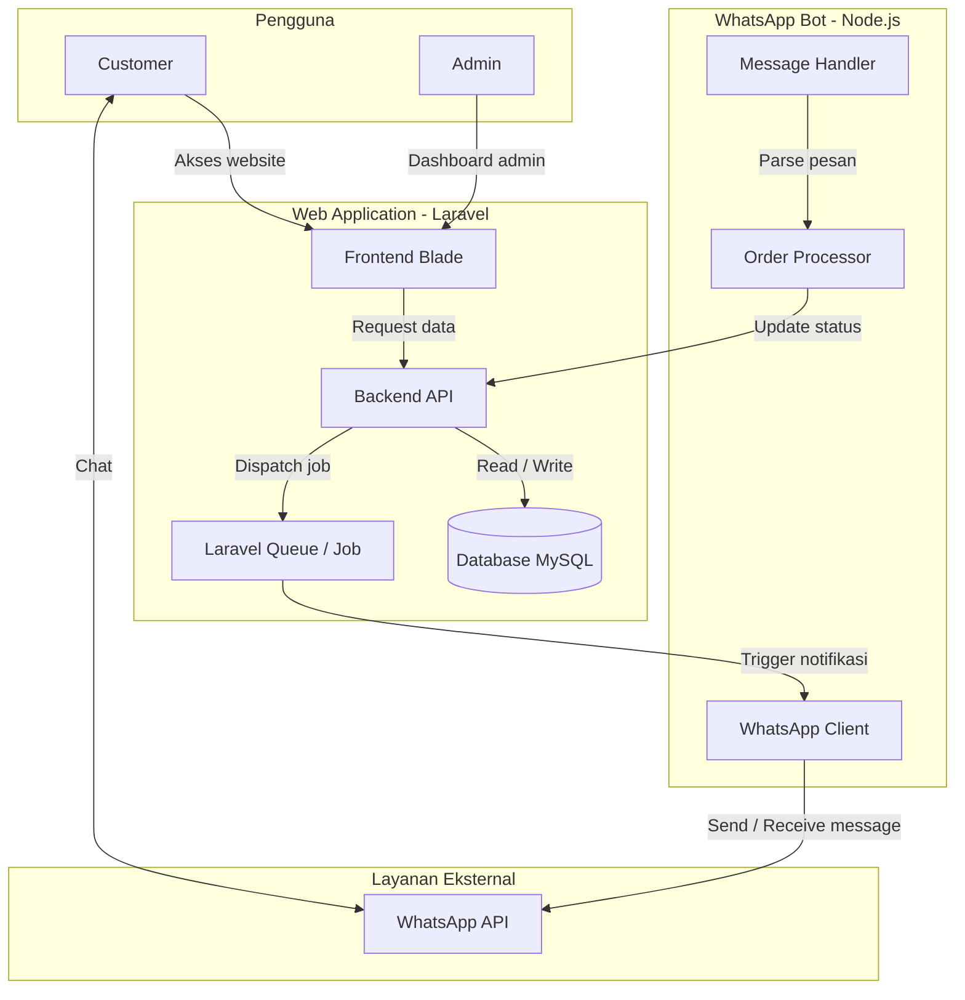
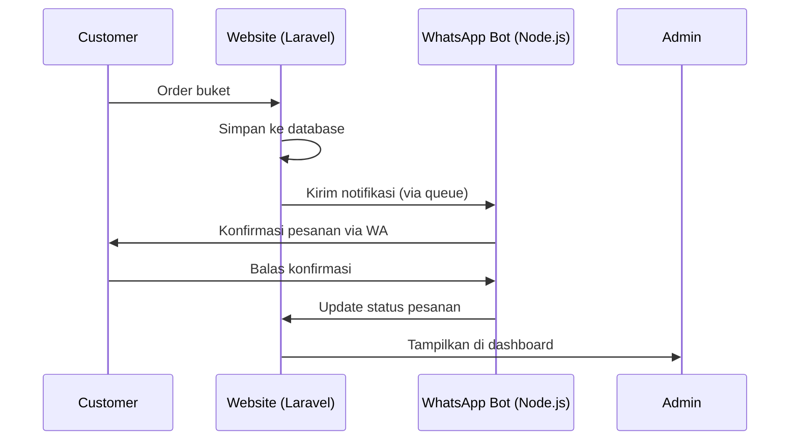

# buket.cute

Aplikasi manajemen pemesanan buket bunga berbasis Laravel dengan integrasi WhatsApp Bot menggunakan Node.js untuk otomatisasi notifikasi dan pemrosesan pesanan.


## Deskripsi Proyek

Proyek ini adalah sistem pemesanan buket bunga yang terdiri dari dua komponen utama:

1. **Web Application (Laravel)** : Sebagai antarmuka untuk customer dan admin, serta pengelolaan database pesanan.
2. **WhatsApp Bot (Node.js)** : Sebagai otomatisasi chat untuk mengirim notifikasi, menerima konfirmasi, dan memperbarui status pesanan secara real-time.

## Arsitektur Sistem

Berikut adalah diagram alur arsitektur sistem buket.cute:



## Alur Kerja Sistem

Berikut diagram sekuensial yang menunjukkan proses dari customer melakukan order hingga admin melihat di dashboard:



## Teknologi yang Digunakan

| Komponen | Teknologi |
|----------|-----------|
| Backend Web | Laravel (PHP 8.1+) |
| Frontend | Blade Template, Bootstrap |
| Database | MySQL 5.7+ |
| WhatsApp Bot | Node.js + whatsapp-web.js |
| Queue Handler | Laravel Queue (Database/Redis) |
| Version Control | Git dan GitHub |

## Prasyarat

Sebelum menjalankan proyek ini, pastikan perangkat Anda telah terinstall:

- PHP >= 8.1
- Composer
- Node.js >= 16.x
- MySQL >= 5.7
- Git

## Langkah Instalasi

### 1. Clone Repository

Buka terminal dan jalankan perintah berikut:

```bash
git clone https://github.com/NadiWarnadi/buket.cute.git
cd buket.cute
```

### 2. Setup Laravel (Backend Web)

```bash
# Install dependency PHP
composer install

# Copy file environment
cp .env.example .env

# Generate application key
php artisan key:generate

# Atur konfigurasi database di file .env, lalu jalankan migrasi
php artisan migrate --seed

# Jalankan server Laravel
php artisan serve
```

### 3. Setup Node.js (WhatsApp Bot)

```bash
# Masuk ke folder bot (sesuaikan dengan nama folder bot Anda)
cd bot

# Install dependency Node.js
npm install

# Jalankan bot
npm start
```

### 4. Jalankan Queue Worker

Queue worker diperlukan untuk mengirim notifikasi secara asinkron.

```bash
php artisan queue:work
```

## Struktur Folder

```
buket.cute/
├── app/                    # Core Laravel
├── bot/                    # WhatsApp Bot (Node.js)
│   ├── src/
│   │   ├── client.js       # Inisialisasi client WhatsApp
│   │   ├── handler.js      # Penanganan pesan masuk
│   │   └── processor.js    # Proses pemrosesan order
│   ├── package.json
│   └── .env
├── config/                 # Konfigurasi Laravel
├── database/               # Migration dan Seeder
├── resources/views/        # Template Blade
├── routes/                 # Routing Web dan API
├── .env.example
├── composer.json
└── README.md
```

## Cara Menjalankan Testing

```bash
# Testing Laravel
php artisan test

# Testing Node.js
cd bot && npm test
```

## Panduan Kontribusi

Jika Anda ingin berkontribusi pada proyek ini, silakan ikuti langkah-langkah berikut:

1. Fork repository ini.
2. Buat branch fitur baru (`git checkout -b fitur/fitur-anda`).
3. Lakukan commit perubahan (`git commit -m "Menambahkan fitur tertentu"`).
4. Push ke branch (`git push origin fitur/fitur-anda`).
5. Buat Pull Request ke branch utama.

## Lisensi

Proyek ini didistribusikan di bawah lisensi MIT. Lihat file `LICENSE` untuk informasi lebih lanjut.

## Kontak

Pemilik: **Nadi Warnadi**  
Link Repository: [https://github.com/NadiWarnadi/buket.cute](https://github.com/NadiWarnadi/buket.cute)

---

Dibuat dengan sepenuh hati. Jangan lupa berikan bintang jika proyek ini bermanfaat!
```
