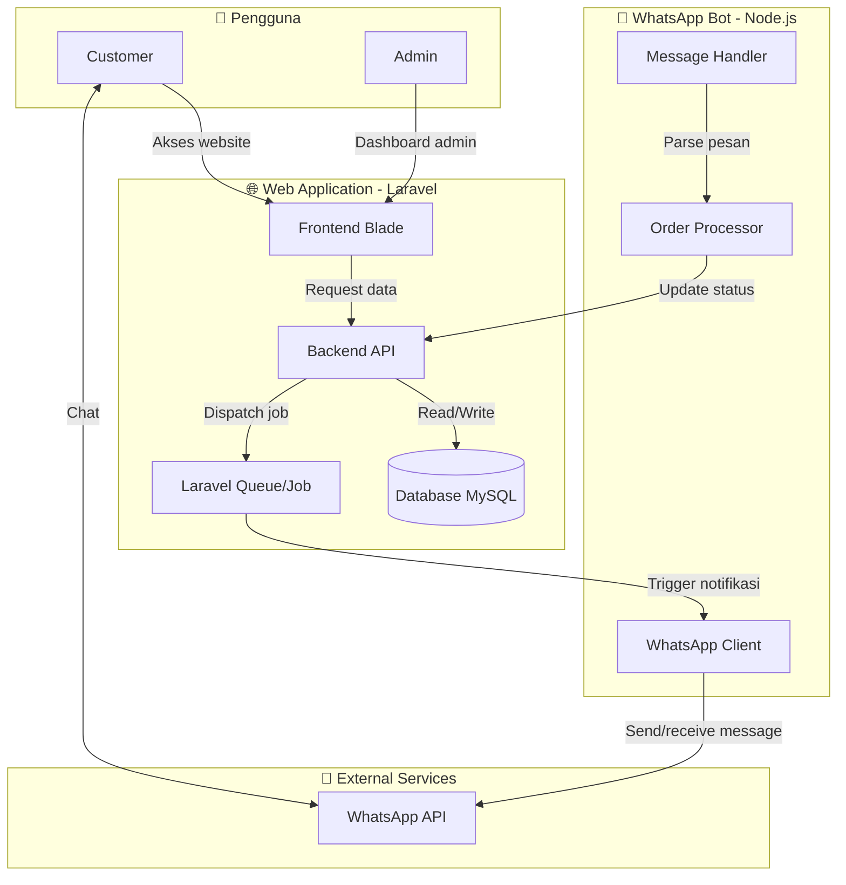

# 🌸 buket.cute

> Aplikasi manajemen pemesanan buket bunga berbasis **Laravel** dengan integrasi **WhatsApp Bot** menggunakan **Node.js** untuk otomatisasi notifikasi dan pemrosesan pesanan.


---

## 🏗️ Arsitektur Sistem

Berikut adalah diagram arsitektur sistem `buket.cute`:


D
📦 Tech Stack
Komponen	Teknologi
Backend Web	Laravel (PHP)
Frontend	Blade Template, Bootstrap
Database	MySQL
WhatsApp Bot	Node.js + whatsapp-web.js
Queue	Laravel Queue (Database/Redis)
Version Control	Git & GitHub
⚙️ Prasyarat
Sebelum menjalankan project, pastikan sudah terinstall:

PHP >= 8.1

Composer

Node.js >= 16.x

MySQL >= 5.7

Git

🚀 Instalasi
1. Clone Repository
bash
git clone https://github.com/NadiWarnadi/buket.cute.git
cd buket.cute
2. Setup Laravel (Backend Web)
bash
# Install dependency PHP
composer install

# Copy environment file
cp .env.example .env

# Generate key
php artisan key:generate

# Setup database di .env, lalu migrate
php artisan migrate --seed

# Jalankan server Laravel
php artisan serve
3. Setup Node.js (WhatsApp Bot)
bash
# Masuk ke folder bot (sesuaikan dengan struktur folder kamu)
cd bot  # atau nama folder tempat WhatsApp Bot

# Install dependency Node.js
npm install

# Jalankan bot
npm start
4. Jalankan Queue Worker (untuk notifikasi)
bash
php artisan queue:work
📁 Struktur Folder
text
buket.cute/
├── app/                    # Laravel core
├── bot/                    # Node.js WhatsApp Bot
│   ├── src/
│   │   ├── client.js       # WhatsApp client
│   │   ├── handler.js      # Message handler
│   │   └── processor.js    # Order processor
│   ├── package.json
│   └── .env
├── config/                 # Laravel config
├── database/               # Migration & seeder
├── resources/views/        # Blade template
├── routes/                 # Web & API routes
├── .env.example
├── composer.json
└── README.md

##🔄 Alur Kerja Sistem
```mermaid
sequenceDiagram
    participant Customer
    participant Web as Website (Laravel)
    participant Bot as WhatsApp Bot (Node.js)
    participant Admin

    Customer->>Web: Order buket
    Web->>Web: Simpan ke database
    Web->>Bot: Kirim notifikasi (via queue)
    Bot->>Customer: Konfirmasi pesanan via WA
    Customer->>Bot: Balas konfirmasi
    Bot->>Web: Update status pesanan
    Web->>Admin: Tampilkan di dashboard

##🧪 Testing
bash
# Laravel tests
php artisan test

# Node.js tests
cd bot && npm test🤝 Kontribusi
Fork repository

Buat branch fitur (git checkout -b feature/AmazingFeature)

Commit perubahan (git commit -m 'Add some AmazingFeature')

Push ke branch (git push origin feature/AmazingFeature)

Buat Pull Request

📄 Lisensi
Distributed under the MIT License. See LICENSE for more information.

📞 Kontak
Nadi Warnadi - GitHub

Project Link: https://github.com/NadiWarnadi/buket.cute

