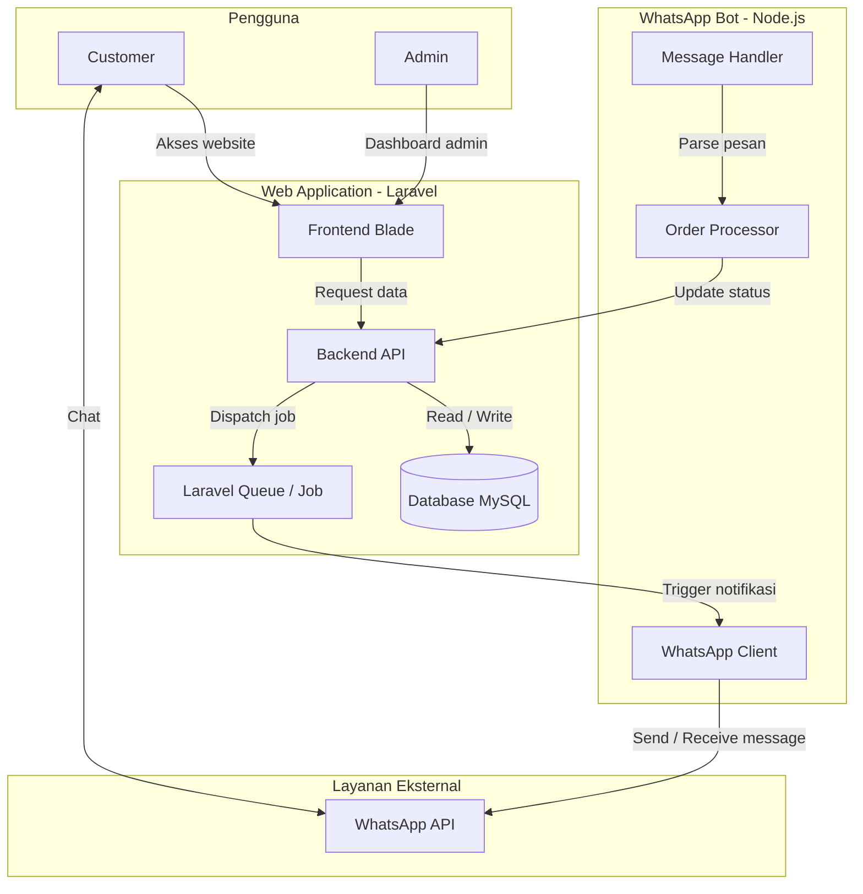
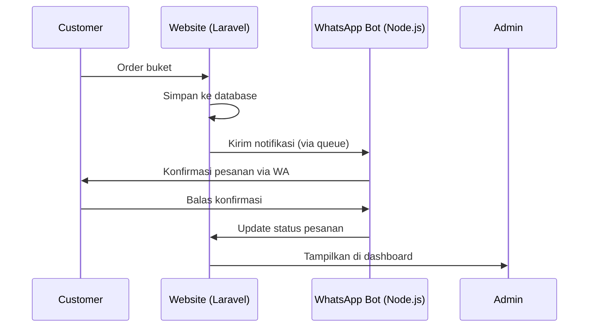

# buket.cute

Aplikasi manajemen pemesanan buket bunga berbasis Laravel dengan integrasi WhatsApp Bot menggunakan Node.js untuk otomatisasi notifikasi dan pemrosesan pesanan.


## Deskripsi Proyek

Proyek ini adalah sistem pemesanan buket bunga yang terdiri dari dua komponen utama:

1. **Web Application (Laravel)** : Sebagai antarmuka untuk customer dan admin, serta pengelolaan database pesanan.
2. **WhatsApp Bot (Node.js)** : Sebagai otomatisasi chat untuk mengirim notifikasi, menerima konfirmasi, dan memperbarui status pesanan secara real-time.

## Arsitektur Sistem

Berikut adalah diagram alur arsitektur sistem buket.cute:



## Alur Kerja Sistem

Berikut diagram sekuensial yang menunjukkan proses dari customer melakukan order hingga admin melihat di dashboard:



## Teknologi yang Digunakan

| Komponen | Teknologi |
|----------|-----------|
| Backend Web | Laravel (PHP 8.1+) |
| Frontend | Blade Template, Bootstrap |
| Database | MySQL 5.7+ |
| WhatsApp Bot | Node.js + wabailey |
| Queue Handler | Laravel Queue (Database/Redis) |
| Version Control | Git dan GitHub |

## Prasyarat

Sebelum menjalankan proyek ini, pastikan perangkat Anda telah terinstall:

- PHP >= 8.1
- Composer
- Node.js >= 16.x
- MySQL >= 5.7
- Git

## Langkah Instalasi

### 1. Clone Repository

Buka terminal dan jalankan perintah berikut:

```bash
git clone https://github.com/NadiWarnadi/buket.cute.git
cd buket.cute
```

### 2. Setup Laravel (Backend Web)

```bash
# Install dependency PHP
composer install

# Copy file environment
cp .env.example .env

# Generate application key
php artisan key:generate

# Atur konfigurasi database di file .env, lalu jalankan migrasi
php artisan migrate --seed

# Jalankan server Laravel
php artisan serve
```

### 3. Setup Node.js (WhatsApp Bot)

```bash
# Masuk ke folder bot (sesuaikan dengan nama folder bot Anda)
cd wa-node-service

# Install dependency Node.js (termasuk Baileys)
npm install

# Copy environment file
cp .env.example .env

# Sesuaikan konfigurasi di .env (misal port, URL Laravel, dll)

# Jalankan bot
npm start

# Install dependency Node.js
npm install

# Jalankan bot
npm start
```

### 4. Jalankan Queue Worker

Queue worker diperlukan untuk mengirim notifikasi secara asinkron.

```bash
php artisan queue:work
```

## Struktur Folder

```
buket.cute/
├── laravel-buket/                     # Aplikasi Laravel (web)
│   ├── app/                           # Kode inti (Models, Controllers, Services, dll)
│   │   ├── Console/Commands/          # Perintah artisan khusus
│   │   ├── Events/                    # Event (misal WhatsAppMessageReceived)
│   │   ├── Helpers/                   # Helper class
│   │   ├── Http/
│   │   │   ├── Controllers/           # Semua controller
│   │   │   │   ├── Admin/             # Controller admin
│   │   │   │   ├── Api/               # Controller API (webhook, whatsapp, midtrans)
│   │   │   │   └── Auth/              # Controller otentikasi
│   │   │   └── Requests/              # Form request validation
│   │   ├── Listeners/                 # Event listener (ProcessMessageWithFuzzyBot)
│   │   ├── Models/                    # Model Eloquent (Customer, Order, Product, dll)
│   │   ├── Observers/                 # Model observers
│   │   ├── Providers/                 # Service providers
│   │   └── Services/                  # Service layer (WhatsAppService, MidtransService, FuzzyBot, dll)
│   ├── bootstrap/                     # Laravel bootstrap
│   ├── config/                        # Semua file konfigurasi
│   ├── database/                      # Migrasi dan seeder
│   ├── public/                        # Asset publik (index.php, build frontend)
│   ├── resources/                     # View Blade, CSS, JS
│   │   ├── css/                       # CSS custom
│   │   ├── js/                        # JavaScript custom
│   │   └── views/                     # Template Blade (admin, auth, public, components)
│   ├── routes/                        # Definisi route (web, api, auth, console)
│   ├── storage/                       # Storage (upload, logs, framework)
│   ├── tests/                         # Unit & Feature tests
│   ├── .env.example                   # Contoh environment
│   ├── artisan                        # CLI Laravel
│   ├── composer.json                  # Dependensi PHP
│   └── package.json                   # Dependensi Node (frontend)
│
├── wa-node-service/                   # WhatsApp Bot (Node.js + Baileys)
│   ├── auth/
│   │   └── wa-session/                # Data sesi WhatsApp (creds, pre-keys, dll)
│   ├── services/                      # Service bot (webhook, queue, antiDetection)
│   │   ├── antiDetection.js
│   │   ├── queue.js
│   │   ├── webhook.js
│   │   └── whatsapp.js
│   ├── middlewares/                   # Express middleware (auth.js)
│   ├── utils/                         # Utility (parser.js)
│   ├── index.js                       # Entry point utama
│   ├── package.json                   # Dependensi Node (Baileys, express, dll)
│   └── .env.example                   # Contoh environment
│
├── wa-mock-server/                    # Mock WhatsApp server untuk testing
│   ├── server.js                      # Mock server
│   └── package.json                   # Dependensi
│
├── Z-dokumentasi/                     # Dokumentasi (diagram, struktur DB)
├── z1-dokumenter/                     # Dokumentasi tambahan (implementation summary, dll)
├── .gitignore
├── LICENSE
└── README.md                          # File ini
```

## Cara Menjalankan Testing

```bash
# Testing Laravel
php artisan test

# Testing Node.js
cd bot && npm test
```

## Panduan Kontribusi

Jika Anda ingin berkontribusi pada proyek ini, silakan ikuti langkah-langkah berikut:

1. Fork repository ini.
2. Buat branch fitur baru (`git checkout -b fitur/fitur-anda`).
3. Lakukan commit perubahan (`git commit -m "Menambahkan fitur tertentu"`).
4. Push ke branch (`git push origin fitur/fitur-anda`).
5. Buat Pull Request ke branch utama.

## Lisensi

Proyek ini didistribusikan di bawah lisensi MIT. Lihat file `LICENSE` untuk informasi lebih lanjut.

## Kontak

Pemilik: **Nadi Warnadi**  
Link Repository: [https://github.com/NadiWarnadi/buket.cute](https://github.com/NadiWarnadi/buket.cute)

---

Dibuat dengan sepenuh hati. Jangan lupa berikan bintang jika proyek ini bermanfaat!
```

---

### 💡 Catatan Tambahan

1. **Struktur folder** saya buat berdasarkan `laravel-buket` sebagai folder utama Laravel dan `wa-node-service` sebagai bot. Jika Anda ingin mengubah nama folder (misal `laravel-buket` menjadi `backend`), silakan sesuaikan.

2. **File .env** di kedua komponen harus diisi sesuai kebutuhan (database, API key Midtrans, konfigurasi bot).

3. Untuk **diagram**, GitHub mendukung Mermaid secara native, jadi diagram akan tampil dengan baik.

4. Jika Anda ingin membuat README terpisah untuk masing-masing komponen (misal di `laravel-buket/README.md` dan `wa-node-service/README.md`), silakan. Saya sarankan tetap pakai satu README di root untuk gambaran besar, dan tambahkan README spesifik di subfolder untuk detail teknis masing-masing.

Silakan copy-paste dan sesuaikan jika perlu. Kalau ada yang ingin diubah, beri tahu saya! 😊


